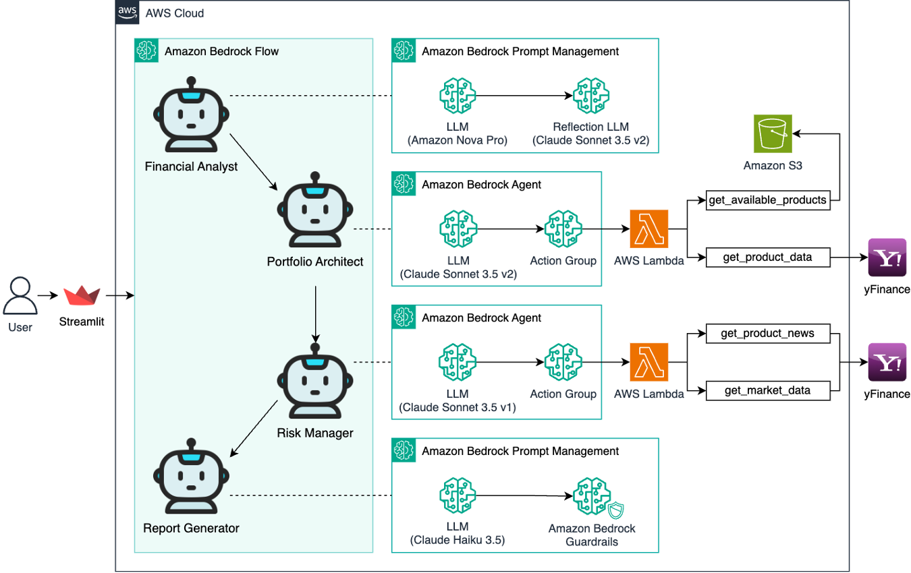

# Agentic AI Investment Advisor

This repository contains practice code for the AWS Bedrock Agentic AI Workshop. Learn and implement Agentic AI's core patterns while building a personalized investment advisor (Private Banker).

> 🔗 **[Amazon Bedrock Agentic AI Workshop - AI Investment Advisor](https://catalog.us-east-1.prod.workshops.aws/workshops/5d74d234-0149-4b82-982a-4c040b85d0f2/en-US)**  
> Access the detailed workshop guide on AWS Workshop Studio. Find step-by-step instructions for each Lab.

](dataset/images/concept.png)

**Architecture**



**Expected Output**


## 📋 Workshop Overview

This workshop helps you understand and implement the four core patterns of Agentic AI through a real-world case (AI Investment Advisor):
- **Reflection**: AI's self-evaluation and improvement
- **Tool use**: Extending AI capabilities using external tools
- **Planning**: Systematic approach to complex tasks
- **Multi Agent**: Collaboration between AI agents

## 🎯 Learning Objectives


Each Lab implements a core pattern of Agentic AI:
- Lab 1: Financial Analyst (Reflection Pattern)
- Lab 2: Portfolio Architect (Tool Use Pattern)
- Lab 3: Risk Manager (Planning Pattern)
- Lab 4: Investment Advisor (Multi Agent Pattern)

## 📂 Project Structure

```
/
├── ko/                               # Korean Practice Code
│   ├── pattern/                      # Agentic AI Pattern Practice
│   ├── financial_analyst/            # Lab 1: Financial Analyst (Reflection)
│   ├── portfolio_architect/          # Lab 2: Portfolio Architect (Tool Use)
│   ├── risk_manager/                 # Lab 3: Risk Manager (Planning)
│   └── investment_advisor/           # Lab 4: Investment Advisor (Multi Agent)
├── en/                               # English Practice Code
├── dataset/                          # Common Dataset
│   └── images/                       # Workshop Images
└── requirements.txt                  # Python Package Dependencies
```

### Lab 1: Financial Analyst
**Pattern: Reflection**

Practice Contents:
1. Financial analysis using Nova Pro model
2. Result verification using Claude
3. Lambda function configuration and testing

> [Lab 1 Guide](https://catalog.us-east-1.prod.workshops.aws/workshops/5d74d234-0149-4b82-982a-4c040b85d0f2/en-US/app/lab1)

### Lab 2: Portfolio Architect
**Pattern: Tool use**

Practice Contents:
1. yfinance API integration
2. S3 data store configuration
3. Bedrock Agent creation and setup

> [Lab 2 Guide](https://catalog.us-east-1.prod.workshops.aws/workshops/5d74d234-0149-4b82-982a-4c040b85d0f2/en-US/app/lab2)

### Lab 3: Risk Manager
**Pattern: Planning**

Practice Contents:
1. News data collection Lambda implementation
2. Scenario planning prompt design
3. Risk analysis system construction

> [Lab 3 Guide](https://catalog.us-east-1.prod.workshops.aws/workshops/5d74d234-0149-4b82-982a-4c040b85d0f2/en-US/app/lab3)

### Lab 4: Investment Advisor
**Pattern: Multi Agent**

Practice Contents:
1. Bedrock Flow configuration
2. Guardrails setup
3. Complete system integration

> [Lab 4 Guide](https://catalog.us-east-1.prod.workshops.aws/workshops/5d74d234-0149-4b82-982a-4c040b85d0f2/en-US/app/lab4)

## 🎯 Target Audience

This workshop is suitable for:
- Developers interested in building real business applications using generative AI
- Data Scientists
- Solution Architects

**Prerequisites**
- Basic understanding of AWS services
- Python programming experience

## 🚀 Getting Started

### Prerequisites
1. [AWS Account](https://aws.amazon.com/)
2. [AWS CLI Installation and Setup](https://aws.amazon.com/cli/)
3. [Python 3.8 or higher](https://www.python.org/downloads/)

### Environment Setup
```bash
# Clone repository
git clone 'repository address'

# Install required packages
pip install -r requirements.txt

# Configure AWS credentials
aws configure
```

## 🔧 Key Technologies

- [Amazon Bedrock](https://aws.amazon.com/bedrock/): Fully managed service for foundation models
- [Amazon Bedrock Prompt Management](https://aws.amazon.com/bedrock/prompt-management/): Service to accelerate prompt engineering and sharing
- [Amazon Bedrock Agent](https://aws.amazon.com/bedrock/agents/): Service to build and deploy AI agents
- [Amazon Bedrock Flow](https://aws.amazon.com/bedrock/flows/): Service to compose complex workflows connecting multiple AI models
- [Amazon Bedrock Guardrails](https://aws.amazon.com/bedrock/guardrails/): Filter and control LLM model inputs and outputs
- [AWS Lambda](https://aws.amazon.com/lambda/): Serverless computing service
- [Amazon S3](https://aws.amazon.com/s3/): Scalable object storage service

---

# Agentic AI Investment Advisor

이 저장소는 AWS Bedrock을 활용한 Agentic AI 워크샵의 실습 코드를 포함하고 있습니다. 개인 맞춤형 재테크 어드바이저(AI Investment Advisor)를 구축하면서 Agentic AI의 핵심 패턴들을 학습합니다.

> 🔗 **[Amazon Bedrock Agentic AI Workshop - AI Investment Advisor](https://catalog.us-east-1.prod.workshops.aws/workshops/5d74d234-0149-4b82-982a-4c040b85d0f2)**  
> AWS Workshop Studio에서 제공되는 상세 실습 가이드입니다. 각 Lab의 단계별 설명을 확인할 수 있습니다.

](dataset/images/concept.png)

**아키텍처**


**예상 결과물**


## 📋 워크샵 개요

이 워크샵에서는 Agentic AI의 4가지 핵심 패턴을 실습하고, 실제 사례(AI 투자 어드바이저)를 통해 구현하고 이해합니다:
- **Reflection**: AI의 자체 평가 및 개선
- **Tool use**: 외부 도구를 활용한 AI 능력 확장
- **Planning**: 복잡한 작업의 체계적 접근
- **Multi Agent**: AI 에이전트 간 협업

## 🎯 학습 목표


각 Lab은 Agentic AI의 핵심 패턴을 실제로 구현합니다:
- Lab 1: 재무 분석가 (Reflection 패턴)
- Lab 2: 포트폴리오 설계사 (Tool Use 패턴)
- Lab 3: 리스크 관리사 (Planning 패턴)
- Lab 4: 종합 투자 어드바이저 (Multi Agent 패턴)

## 📂 실습 코드 구조

```
/
├── ko/                               # 한국어 실습 코드
│   ├── pattern/                      # Agentic AI 패턴 실습
│   ├── financial_analyst/            # Lab 1: 재무 분석가 (Reflection)
│   ├── portfolio_architect/          # Lab 2: 포트폴리오 설계사 (Tool Use)
│   ├── risk_manager/                 # Lab 3: 리스크 관리사 (Planning)
│   └── investment_advisor/           # Lab 4: 투자 어드바이저 (Multi Agent)
├── en/                               # 영어 실습 코드 (English)
├── dataset/                          # 공통 데이터셋
│   └── images/                       # 워크샵 이미지
└── requirements.txt                  # Python 패키지 의존성
```

### Lab 1: 재무 분석가 (Financial Analyst)
**패턴: Reflection**

실습 내용:
1. Nova Pro 모델을 사용한 재무 분석
2. Claude를 활용한 분석 결과 검증
3. Lambda 함수 구성 및 테스트

> [Lab 1 실습 가이드](https://catalog.us-east-1.prod.workshops.aws/workshops/5d74d234-0149-4b82-982a-4c040b85d0f2/ko-KR/app/lab1)

### Lab 2: 포트폴리오 설계사 (Portfolio Architect)
**패턴: Tool use**

실습 내용:
1. yfinance API 연동
2. S3 데이터 저장소 구성
3. Bedrock Agent 생성 및 설정

> [Lab 2 실습 가이드](https://catalog.us-east-1.prod.workshops.aws/workshops/5d74d234-0149-4b82-982a-4c040b85d0f2/ko-KR/app/lab2)

### Lab 3: 리스크 관리사 (Risk Manager)
**패턴: Planning**

실습 내용:
1. 뉴스 데이터 수집 Lambda 구현
2. 시나리오 플래닝 프롬프트 설계
3. 리스크 분석 시스템 구축

> [Lab 3 실습 가이드](https://catalog.us-east-1.prod.workshops.aws/workshops/5d74d234-0149-4b82-982a-4c040b85d0f2/ko-KR/app/lab3)

### Lab 4: 투자 어드바이저 (Investment Advisor)
**패턴: Multi Agent**

실습 내용:
1. Bedrock Flow 구성
2. Guardrails 설정
3. 전체 시스템 통합

> [Lab 4 실습 가이드](https://catalog.us-east-1.prod.workshops.aws/workshops/5d74d234-0149-4b82-982a-4c040b85d0f2/ko-KR/app/lab4)

## 🎯 대상

이 워크샵은 다음과 같은 분들에게 적합합니다:
- 생성형 AI를 활용한 실제 비즈니스 애플리케이션 개발에 관심이 있는 개발자
- 데이터 과학자
- 솔루션 아키텍트

**사전 지식**
- AWS 서비스에 대한 기본적인 이해
- Python 프로그래밍 경험

## 🚀 시작하기

### 사전 준비사항
1. [AWS 계정](https://aws.amazon.com/ko/)
2. [AWS CLI 설치 및 설정](https://aws.amazon.com/ko/cli/)
3. [Python 3.8 이상](https://www.python.org/downloads/)

### 환경 설정
```bash
# 리포지토리 클론
git clone 'repository address'

# 필요한 패키지 설치
pip install -r requirements.txt

# AWS 자격 증명 설정
aws configure
```

## 🔧 주요 기술

- [Amazon Bedrock](https://aws.amazon.com/bedrock/): 다양한 기초 모델(FM)을 활용할 수 있는 완전 관리형 서비스
- [Amazon Bedrock Prompt Management](https://aws.amazon.com/bedrock/prompt-management/): 프롬프트 엔지니어링을 가속화하고 프롬프트 공유를 쉽게 만드는 서비스
- [Amazon Bedrock Agent](https://aws.amazon.com/bedrock/agents/): AI 에이전트를 구축하고 배포할 수 있는 서비스
- [Amazon Bedrock Flow](https://aws.amazon.com/bedrock/flows/): 여러 AI 모델을 연결하여 복잡한 워크플로우를 구성할 수 있는 서비스
- [Amazon Bedrock Guardrails](https://aws.amazon.com/bedrock/guardrails/): LLM 모델의 입력과 출력을 필터링하고 제어
- [AWS Lambda](https://aws.amazon.com/lambda/): 서버리스 컴퓨팅 서비스
- [Amazon S3](https://aws.amazon.com/s3/): 확장 가능한 객체 스토리지 서비스

